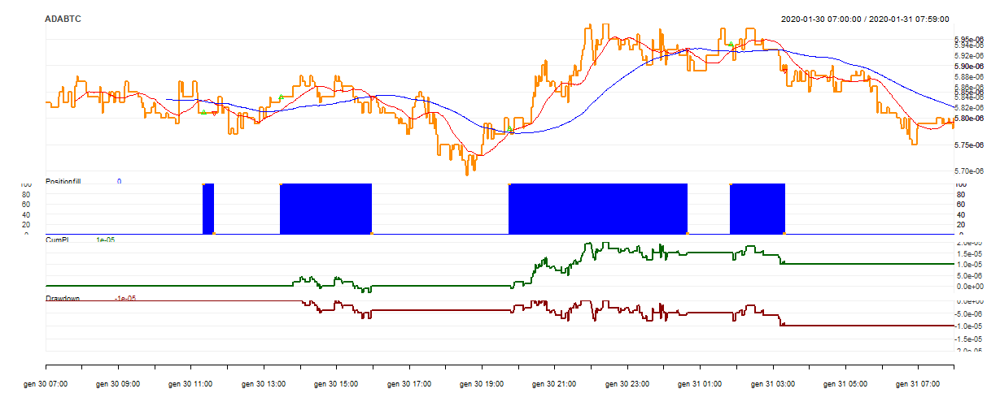

# SIRDAN  

## about

in this first version, this package provide a function to get criptiocurrencies pairs in 
a very easy way. It also provide example scripts which allow you to run backtest on these data. (9b8b657e/inst/)

It leverage quantstrat and blotter which is built on quantmod. 

the following is the output of the script in (9b8b657e/inst/) which is a simple trend following strategy on ADA/BTC in 1 minute time frame.

## usage

you can use this package typing:

devtools::install_github("unimi-dse/9b8b657e")

You can download all criptocurrency pair directly from the Kucoin API, look at the platform to be inspired. Be careful: some pairs are very recent so be sure to use a valid "starting date" parameter.

a look to the sample script is recommended.

more about developing YOUR trading strategy at https://www.rdocumentation.org/packages/quantstrat/versions/0.16.6

## prolems

this project has 2 main issues: 

- high dependency: it is built on quantmod, which is based on stock trading. This brought problems in the implementation of a backtesting function with external data.

- GetKucoinData: retrieves up to 1500 relevations, whey too few in order to have a useful backtest. That's due to the restful API request's constraints.
